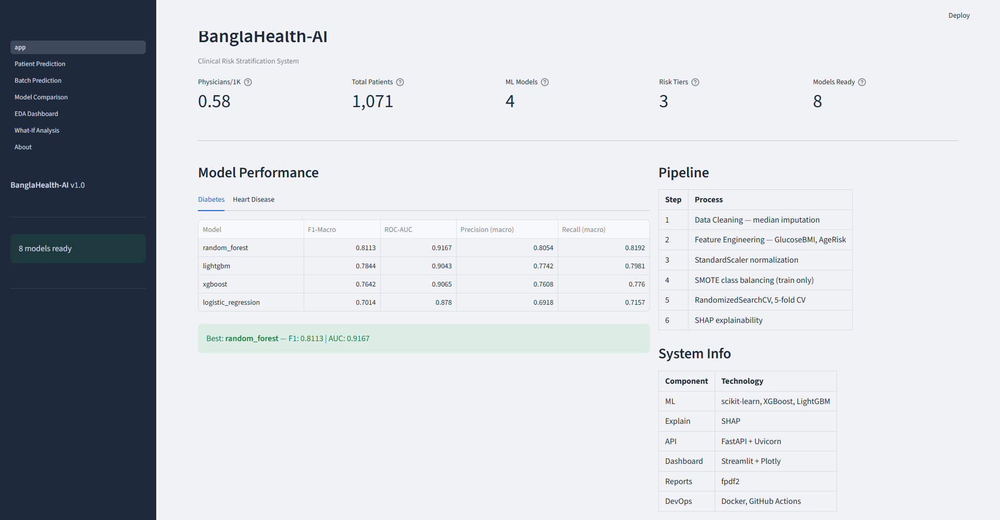
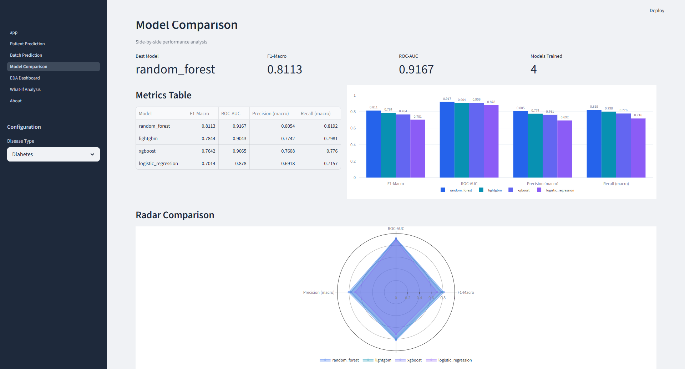
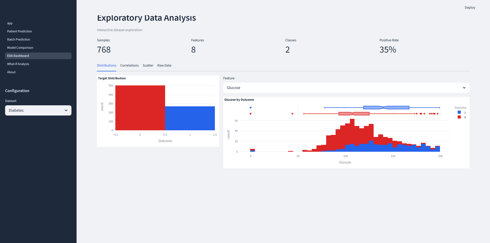
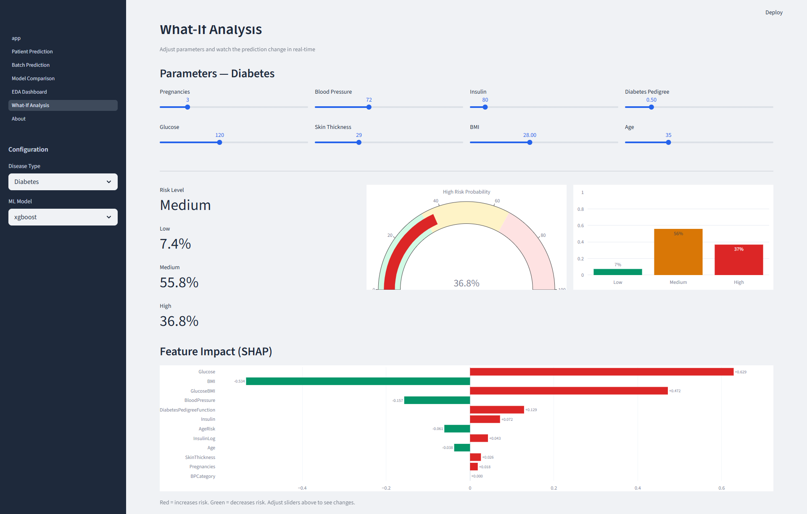
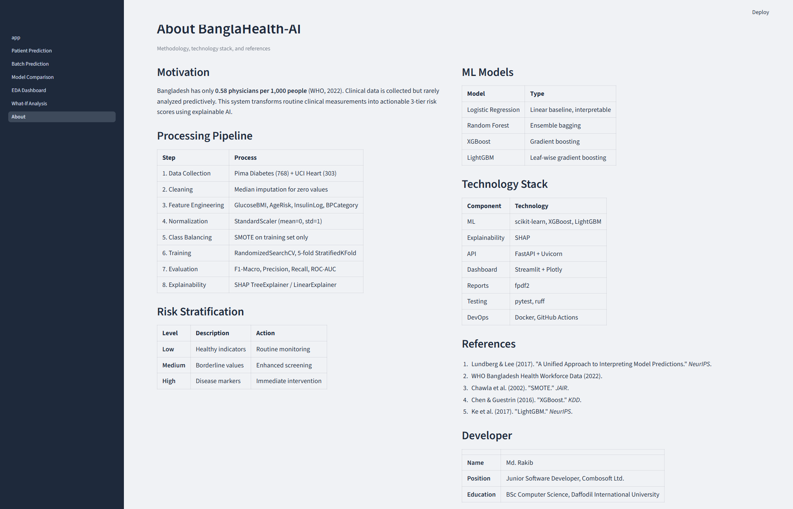

# BanglaHealth-AI

**Explainable AI for Patient Risk Stratification in Low-Resource Clinical Settings**

> Bangladesh has only **0.58 physicians per 1,000 people** (WHO, 2022). Clinical data is collected daily but rarely analyzed predictively. BanglaHealth-AI bridges this gap by transforming routine clinical measurements into explainable, three-tier risk scores — empowering health workers, doctors, and public health officials to make informed, life-saving decisions.



---

## Table of Contents

- [The Problem](#the-problem)
- [What BanglaHealth-AI Does](#what-banglahealth-ai-does)
- [Who Uses This and Why](#who-uses-this-and-why)
- [Real-Life Impact](#real-life-impact)
- [Dashboard Pages](#dashboard-pages)
- [Complete Workflow](#complete-workflow)
- [Model Performance](#model-performance)
- [Tech Stack](#tech-stack)
- [Project Structure](#project-structure)
- [Quick Start](#quick-start)
- [API Endpoints](#api-endpoints)
- [Datasets](#datasets)
- [Feature Engineering](#feature-engineering)
- [Methodology](#methodology)
- [Documentation](#documentation)
- [Author](#author)
- [References](#references)
- [License](#license)

---

## The Problem

Bangladesh faces a severe healthcare workforce shortage:

- **0.58 physicians per 1,000 people** — one of the lowest ratios in South Asia
- Rural patients often travel hours to see a doctor
- District hospitals see **100+ patients per day** per doctor
- Clinical measurements (blood pressure, glucose, cholesterol) are collected routinely but **rarely analyzed predictively**
- Late detection of diabetes and heart disease leads to preventable complications and death

**BanglaHealth-AI solves this** by giving any health worker — even without ML knowledge — the ability to enter patient vitals and instantly receive an AI-powered risk assessment with clear explanations.

---

## What BanglaHealth-AI Does

| Feature | Description |
|---------|-------------|
| **3-Class Risk Prediction** | Classifies patients as Low / Medium / High risk with confidence scores |
| **SHAP Explanations** | Shows exactly which features drove each prediction and by how much |
| **Clinical Alerts** | Generates human-readable medical insights (e.g., "Glucose >= 140 mg/dL — significantly elevated") |
| **What-If Analysis** | Adjust patient parameters with sliders, watch risk change in real-time |
| **Batch Prediction** | Upload a CSV of patients, get risk scores for all of them instantly |
| **PDF Reports** | Downloadable patient reports with risk level, alerts, SHAP values, and disclaimer |
| **Model Comparison** | Side-by-side metrics, bar charts, and radar plots for all 4 models |
| **Fairness Analysis** | Evaluates model performance across age, sex, and BMI demographic groups |
| **REST API** | FastAPI endpoints with Pydantic validation and auto-generated Swagger docs |
| **Interactive EDA** | Explore datasets with distributions, correlations, scatter plots, and raw data |

---

## Who Uses This and Why

### Community Health Workers (CHWs) in Rural Areas
- Enter patient vitals into a simple form
- Get instant Low/Medium/High risk assessment
- Know who needs urgent referral to a doctor
- **No ML knowledge required** — the system speaks in clinical language

### Primary Care Physicians in District Hospitals
- **Triage 100+ patients/day** — quickly identify who needs immediate attention
- Batch upload a ward's patient data to find all high-risk cases
- Use What-If Analysis: "If we get this patient's glucose down to 110, does risk drop?"
- Download PDF reports for patient records

### Public Health Officials & NGOs
- Upload population-level data to identify high-risk clusters
- Compare which ML model performs best on their specific population
- Explore disease patterns across demographics with the EDA Dashboard
- Fairness analysis ensures models don't discriminate by age, sex, or BMI

### Medical Researchers & Students
- Every prediction is transparent — SHAP values show the "why" behind each decision
- Full reproducible pipeline from raw data to trained models
- Open-source with academic references (Lundberg & Lee, SMOTE, XGBoost, LightGBM)
- Model Card follows Google's ML documentation standard

---

## Real-Life Impact

### Saving Lives Through Early Detection
A patient with borderline glucose (135) and high BMI (32) might look "fine" on paper. BanglaHealth-AI catches the interaction effect (GlucoseBMI feature) and flags **Medium Risk** — that patient gets enhanced screening instead of being sent home. Early intervention for diabetes and heart disease **reduces mortality by 30-50%**.

### Bridging the Doctor Shortage
Instead of 1 doctor examining every patient, health workers pre-screen using AI. Only High Risk patients get immediate doctor attention. Medium Risk patients get scheduled follow-ups. This effectively **multiplies each doctor's capacity by 3-5x**.

### Transparent, Trustworthy AI
Unlike black-box models, every prediction comes with SHAP explanations. A doctor can see: "Risk is High **because** glucose is 210 and BMI is 38." Clinical alerts translate ML outputs to medical language. PDF reports create a **paper trail** for medical records — critical in low-resource settings.

### Reducing Healthcare Inequality
Rural patients get the same risk assessment quality as urban hospital patients. The fairness module checks for bias across demographic groups. Deployed via Docker, it runs on any basic computer with a browser. No internet required once deployed locally.

### Cost Savings
Prevents unnecessary specialist referrals (Low Risk patients) while catching high-risk patients early (preventing expensive emergency care). A single screening that catches undiagnosed diabetes saves an estimated **$4,000-$10,000** in future treatment costs per patient.

---

## Dashboard Pages

### Home — System Overview
Key metrics at a glance: physician ratio, total patients, models trained, risk tiers. Model performance comparison tables for both diabetes and heart disease, ML pipeline steps, and technology stack.


### Patient Prediction
Single patient risk assessment with interactive input sliders. Results include risk level, confidence scores, gauge chart, SHAP feature impact chart, clinical findings with severity colors, and downloadable PDF report.

### Batch Prediction
Upload a CSV of patients, select disease type and model, get bulk predictions. Displays risk distribution (pie chart), per-patient confidence scores, and export to CSV.

### Model Comparison
Side-by-side performance analysis of all 4 models. Grouped bar chart, radar comparison, and detailed metrics table with F1-Macro, ROC-AUC, Precision, and Recall.



### EDA Dashboard
Interactive exploratory data analysis. Tabs for distributions (histograms with box plots), correlation heatmap, scatter plots, and full dataset statistics.



### What-If Analysis
Real-time parameter sensitivity testing. Adjust any clinical parameter with sliders and watch the prediction, gauge chart, probability bar chart, and SHAP feature impact update instantly.



### About
Methodology documentation, processing pipeline, risk stratification criteria, ML models, technology stack, references, and developer info.



---

## Complete Workflow

```
Raw Patient Data (diabetes.csv / heart.csv)
         |
         v
  1. Data Loading & Validation (src/data_loader.py)
         |
         v
  2. Data Cleaning (src/preprocessing.py)
     - Replace biologically impossible zeros with median
     - Convert binary outcomes --> 3-class risk (Low/Medium/High)
         |
         v
  3. Feature Engineering (src/feature_engineering.py)
     - Diabetes: GlucoseBMI, AgeRisk, InsulinLog, BPCategory
     - Heart: BPxHR, CholAge, HeartStress
         |
         v
  4. Preprocessing (src/preprocessing.py)
     - StandardScaler normalization (mean=0, std=1)
     - Stratified 80/20 train/test split
     - SMOTE applied to training set only (prevents data leakage)
         |
         v
  5. Model Training (src/model.py)
     - 4 Models: Logistic Regression, Random Forest, XGBoost, LightGBM
     - RandomizedSearchCV with 5-fold StratifiedKFold
     - Optimization metric: F1-Macro
         |
         v
  6. Evaluation & Comparison (src/model.py)
     - F1-Macro, Precision (macro), Recall (macro), ROC-AUC
     - Confusion matrices & classification reports
         |
         v
  7. Explainability (src/explainer.py)
     - SHAP TreeExplainer (tree models) / LinearExplainer (LR)
     - Clinical alerts with domain-specific thresholds
         |
         v
  8. Fairness Analysis (src/fairness.py)
     - Evaluate across age groups, sex, BMI categories
     - Flag performance gaps > 0.10
         |
         v
  9. Delivery
     +-- Streamlit Dashboard (app/) --> Interactive web UI
     +-- FastAPI (api/)              --> REST endpoints
     +-- PDF Reports (components/)   --> Downloadable patient reports
```

---

## Model Performance

### Diabetes Risk Prediction

| Model | F1-Macro | ROC-AUC | Precision (macro) | Recall (macro) |
|-------|----------|---------|-------------------|----------------|
| **Random Forest** | **0.8113** | **0.9167** | **0.8054** | **0.8192** |
| LightGBM | 0.7844 | 0.9043 | 0.7742 | 0.7981 |
| XGBoost | 0.7642 | 0.9065 | 0.7608 | 0.7760 |
| Logistic Regression | 0.7014 | 0.8780 | 0.6918 | 0.7157 |

### Heart Disease Risk Prediction

| Model | F1-Macro | ROC-AUC | Precision (macro) | Recall (macro) |
|-------|----------|---------|-------------------|----------------|
| **Logistic Regression** | **0.7592** | **0.9417** | — | — |
| Random Forest | 0.7486 | — | — | — |
| LightGBM | 0.7373 | — | — | — |
| XGBoost | 0.6654 | — | — | — |

> Best diabetes model: **Random Forest** (F1: 0.8113, AUC: 0.9167)
> Best heart model: **Logistic Regression** (F1: 0.7592, AUC: 0.9417)

---

## Tech Stack

| Layer | Technology | Purpose |
|-------|-----------|---------|
| **ML/Data** | scikit-learn, XGBoost, LightGBM, pandas, NumPy | Model training, data processing |
| **Explainability** | SHAP | TreeExplainer & LinearExplainer for interpretability |
| **API** | FastAPI, Pydantic, Uvicorn | REST endpoints with validation & Swagger docs |
| **Dashboard** | Streamlit, Plotly | Interactive web UI with real-time charts |
| **Reports** | fpdf2 | PDF patient report generation |
| **Testing** | pytest, ruff | Unit/integration tests, linting & formatting |
| **DevOps** | Docker, docker-compose | Containerization & multi-service orchestration |
| **CI/CD** | GitHub Actions | Automated lint, test, and format checks |

---

## Project Structure

```
BanglaHealth-AI/
├── data/
│   ├── raw/                          # Original datasets (diabetes.csv, heart.csv)
│   └── processed/                    # Cleaned, engineered, split datasets
├── notebooks/
│   ├── 01_eda.ipynb                  # Exploratory Data Analysis
│   ├── 02_preprocessing.ipynb        # Cleaning & Feature Engineering
│   ├── 03_model_training.ipynb       # Train 4 models with hyperparameter tuning
│   ├── 04_evaluation.ipynb           # Metrics, confusion matrices, comparison
│   ├── 05_explainability.ipynb       # SHAP analysis & clinical insights
│   └── 06_fairness_analysis.ipynb    # Demographic fairness evaluation
├── src/
│   ├── data_loader.py                # Load & validate datasets
│   ├── preprocessing.py              # Cleaning, scaling, SMOTE, risk labels
│   ├── feature_engineering.py        # Derived clinical features
│   ├── model.py                      # Train, evaluate, compare, save models
│   ├── explainer.py                  # SHAP explanations & clinical alerts
│   ├── fairness.py                   # Fairness analysis across demographics
│   └── utils.py                      # Plotting & directory helpers
├── api/
│   ├── main.py                       # FastAPI app entry point with CORS
│   ├── schemas.py                    # Pydantic input/output validation
│   └── routes/
│       ├── predict.py                # /predict/* endpoints (single & batch)
│       └── explain.py                # /explain/* endpoints with SHAP values
├── app/
│   ├── app.py                        # Dashboard home page
│   ├── styles.py                     # Shared CSS (dark sidebar theme)
│   ├── pages/
│   │   ├── 1_Patient_Prediction.py   # Single patient risk prediction + PDF
│   │   ├── 2_Batch_Prediction.py     # CSV upload bulk prediction
│   │   ├── 3_Model_Comparison.py     # Side-by-side model metrics
│   │   ├── 4_EDA_Dashboard.py        # Interactive dataset exploration
│   │   ├── 5_What-If_Analysis.py     # Real-time parameter sensitivity
│   │   └── 6_About.py               # Methodology & references
│   └── components/
│       ├── clinical_alert.py         # Alert rendering with severity styling
│       ├── pdf_report.py             # PDF patient report generation
│       ├── shap_plots.py             # SHAP visualization helpers
│       └── risk_card.py              # Risk summary card
├── models/                           # Saved trained models (.joblib)
├── outputs/                          # Generated plots, reports, comparison CSVs
├── tests/                            # pytest test suite
├── docs/
│   └── screenshots/                  # Dashboard screenshots
├── .github/workflows/
│   └── ci.yml                        # GitHub Actions CI pipeline
├── Dockerfile                        # Container image
├── docker-compose.yml                # API + Dashboard services
├── requirements.txt                  # Python dependencies
├── MODEL_CARD.md                     # Model documentation (Google standard)
└── plan.md                           # Detailed project plan
```

---

## Quick Start

### Option 1: Local Setup

```bash
# Clone the repository
git clone https://github.com/muhammadrakib2299/BanglaHealth-AI.git
cd BanglaHealth-AI

# Create virtual environment (Python 3.12 or 3.13)
python -m venv venv
source venv/bin/activate        # Linux/Mac
# venv\Scripts\activate          # Windows

# Install dependencies
pip install -r requirements.txt

# Train models (run notebooks or use the training pipeline)
jupyter notebook notebooks/

# Launch the dashboard
streamlit run app/app.py
# Dashboard: http://localhost:8501

# Launch the API (separate terminal)
uvicorn api.main:app --reload
# API Docs: http://localhost:8000/docs

# Run tests
pytest tests/ -v
```

### Option 2: Docker

```bash
# Build and run everything with one command
docker-compose up --build

# API:       http://localhost:8000/docs
# Dashboard: http://localhost:8501
```

---

## API Endpoints

| Method | Endpoint | Description |
|--------|----------|-------------|
| `POST` | `/predict/diabetes` | Single diabetes risk prediction |
| `POST` | `/predict/heart` | Single heart disease risk prediction |
| `POST` | `/predict/diabetes/batch` | Batch diabetes prediction (CSV upload) |
| `POST` | `/predict/heart/batch` | Batch heart disease prediction (CSV upload) |
| `POST` | `/explain/diabetes` | SHAP explanation for diabetes prediction |
| `POST` | `/explain/heart` | SHAP explanation for heart disease prediction |
| `GET`  | `/models` | List available trained models |
| `GET`  | `/docs` | Interactive Swagger documentation |

### Example API Request

```bash
curl -X POST http://localhost:8000/predict/diabetes \
  -H "Content-Type: application/json" \
  -d '{
    "Pregnancies": 6, "Glucose": 148, "BloodPressure": 72,
    "SkinThickness": 35, "Insulin": 0, "BMI": 33.6,
    "DiabetesPedigreeFunction": 0.627, "Age": 50
  }'
```

### Example Response

```json
{
  "risk_level": "High",
  "confidence": {"Low": 0.05, "Medium": 0.15, "High": 0.80},
  "alerts": [
    "Glucose >= 140 mg/dL — significantly elevated",
    "BMI >= 30 — obese range"
  ]
}
```

---

## Datasets

| Dataset | Samples | Features | Target | Source |
|---------|---------|----------|--------|--------|
| Pima Indians Diabetes | 768 | 8 | Diabetes (binary -> 3-class risk) | UCI / Kaggle |
| UCI Heart Disease (Cleveland) | 303 | 13 | Heart Disease (binary -> 3-class risk) | UCI Repository |

### 3-Class Risk Stratification

| Level | Diabetes Criteria | Heart Criteria | Clinical Action |
|-------|------------------|----------------|-----------------|
| **Low** | No diabetes + Glucose < 120 + BMI < 30 | No disease + RestBP < 130 + Chol < 240 | Routine monitoring |
| **Medium** | No diabetes + elevated glucose or BMI | No disease + elevated BP or cholesterol | Enhanced screening |
| **High** | Diabetic (positive outcome) | Heart disease present | Immediate intervention |

---

## Feature Engineering

### Diabetes Features

| Feature | Formula | Clinical Significance |
|---------|---------|----------------------|
| GlucoseBMI | Glucose x BMI | Captures metabolic syndrome interaction |
| AgeRisk | Age / BMI | Age-related risk adjustment |
| InsulinLog | log(1 + Insulin) | Normalizes right-skewed insulin distribution |
| BPCategory | Binned BP (AHA guidelines) | 0=Normal, 1=Elevated, 2=High |

### Heart Disease Features

| Feature | Formula | Clinical Significance |
|---------|---------|----------------------|
| BPxHR | RestBP x MaxHR | Cardiovascular stress indicator |
| CholAge | Cholesterol / Age | Age-adjusted cholesterol risk |
| HeartStress | MaxHR / Age | Exercise tolerance relative to age |

---

## Methodology

| Step | Process | Details |
|------|---------|---------|
| 1 | **Data Collection** | Pima Diabetes (768 samples) + UCI Heart (303 samples) |
| 2 | **Data Cleaning** | Median imputation for biologically impossible zero values |
| 3 | **Feature Engineering** | 4 diabetes features + 3 heart features (clinically motivated) |
| 4 | **Normalization** | StandardScaler (mean=0, std=1) fitted on training data only |
| 5 | **Class Balancing** | SMOTE on training set only (prevents data leakage) |
| 6 | **Model Training** | RandomizedSearchCV, 5-fold StratifiedKFold, F1-Macro optimization |
| 7 | **Evaluation** | F1-Macro, Precision, Recall, ROC-AUC, confusion matrices |
| 8 | **Explainability** | SHAP TreeExplainer (tree models) / LinearExplainer (logistic regression) |
| 9 | **Fairness** | Performance evaluation across age, sex, and BMI demographic subgroups |

### Models

| Model | Type | Strengths |
|-------|------|-----------|
| Logistic Regression | Linear | Interpretable baseline, fast inference |
| Random Forest | Ensemble (bagging) | Robust to overfitting, handles nonlinearity |
| XGBoost | Gradient boosting | High accuracy, handles missing values |
| LightGBM | Leaf-wise boosting | Fast training, memory efficient |

---

## Documentation

- [**PROJECT PLAN**](plan.md) — Detailed implementation roadmap
- [**MODEL CARD**](MODEL_CARD.md) — Model documentation following Google's standard

---

## Author

**Md. Rakib**
- Junior Software Developer, Combosoft Ltd.
- BSc Computer Science, Daffodil International University
- GitHub: [@muhammadrakib2299](https://github.com/muhammadrakib2299)

---

## References

1. Lundberg, S. M., & Lee, S. I. (2017). "A Unified Approach to Interpreting Model Predictions." *NeurIPS*.
2. WHO Bangladesh Health Workforce Data (2022).
3. Chawla, N. V., et al. (2002). "SMOTE: Synthetic Minority Over-sampling Technique." *JAIR*.
4. Chen, T., & Guestrin, C. (2016). "XGBoost: A Scalable Tree Boosting System." *KDD*.
5. Ke, G., et al. (2017). "LightGBM: A Highly Efficient Gradient Boosting Decision Tree." *NeurIPS*.

---

## License

MIT License
